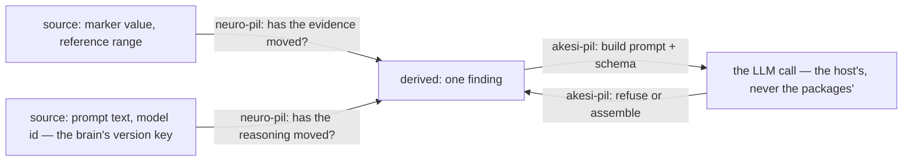

# Architecture

This page is about how a host assembles the two packages into one brain. Neither package's contract is
here — each ships its own, and those are the documents to read if you are implementing against one:

| Contract | Specifies | Read it when |
|---|---|---|
| [`neuro-pil/ARCHITECTURE.md`](neuro-pil/ARCHITECTURE.md) | The node schema, the canonical hashing algorithm byte-for-byte, the stamp file, the lint rules, the diagram format | You are porting the engine to another language, or need to know exactly what makes a node stale |
| [`akesi-pil/ARCHITECTURE.md`](akesi-pil/ARCHITECTURE.md) | The prompt-construction contract, the response-refusal taxonomy, the two convergence loops, the model seam, the safety invariants | You are adapting the domain package, or want to see what "enforce the prompt in code" means concretely |

## Two packages, no edge between them

The repo answers one question in two halves — *is this derived value still good?* — and the halves are
split the way the question is:

- **[`neuro-pil/`](neuro-pil/)** tracks **what a value was derived from**. Declare a graph of sources
  and derived nodes; it computes a stamp per node from that node's transitive sources and reports which
  stamps have moved. It never runs, understands or trusts the derivation itself.
- **[`akesi-pil/`](akesi-pil/)** checks **what came back**. It builds schema-constrained prompts for one
  real domain — clinical reasoning over lab and marker data — and re-enforces in code every constraint
  the prompt states in prose.

The load-bearing fact about this repo's structure: **neither package imports the other.** `akesi-pil`
does not depend on `neuro-pil`, and `neuro-pil` has no idea `akesi-pil` exists. There is no shared
`common/`, no base class, no plugin interface. A host application is what joins them, and that is the
whole architecture:

Both left-hand edges are `neuro-pil` doing the same thing to different evidence, and that is the point
of declaring the prompt as a source rather than teaching the engine about prompts. A stored finding is
trustworthy only when **both** stamps still hold: the markers it read have not moved, *and* the
reasoning that read them is the same reasoning.

The reason to keep it this way is that the engine's claim is general and the domain's is not.
`neuro-pil` is a dependency-graph and hashing library; a graph over weather stations, invoices or build
artifacts is as valid a consumer as a graph over lab markers. Letting the domain reach into the engine
would quietly narrow that claim to the one domain that happened to motivate it. `akesi-pil` is that
domain — kept as a sibling to prove the engine is separable, not as a demonstration of its API.

## Building a brain

Both packages are deliberately incomplete, and in the same direction: they compute, and the host
decides and executes. Assembling them into a brain — the unit the
[README defines](README.md#what-this-is-for) — is six steps, and only two of them are library calls:

| Step | What the host does | Specified in |
|---|---|---|
| 1. **Declare it** | name the `{prompt, model, schema, audience}` unit and look it up by key at the point a reasoning step runs, rather than importing a prompt constant at the call site | [`akesi-pil/ARCHITECTURE.md`](akesi-pil/ARCHITECTURE.md) §8 |
| 2. **Version it** | hash the prompt text, the schema *and* the model id into a version key; a missing key means genuinely unknown and is never defaulted to the current one | [`akesi-pil/ARCHITECTURE.md`](akesi-pil/ARCHITECTURE.md) §8 |
| 3. **Stamp the evidence** | declare the prompt and the model id as `source` nodes beside the data, then record `canonicalFor` per node | [`neuro-pil/README.md`](neuro-pil/README.md#declaring-the-prompt-as-a-source-node) |
| 4. **Enforce the response** | re-check in code every constraint the prompt states in prose, and refuse rather than store what fails | [`akesi-pil/ARCHITECTURE.md`](akesi-pil/ARCHITECTURE.md) §4 |
| 5. **Score before promoting** | run candidate versions over a fixed case set and compare means | [`neuro-pil/README.md`](neuro-pil/README.md#scoring-competing-versions--comparebrains) |
| 6. **Log what regenerated** | append-only: what ran, when, under which version. Never rewritten | [`akesi-pil/ARCHITECTURE.md`](akesi-pil/ARCHITECTURE.md) §8 |

Steps 3 and 5 are `neuro-pil` calls and step 4 is `akesi-pil`'s discipline. The rest is the host's, and
deliberately so — a registry's shape, a log's storage and a scoring rubric are decisions neither
package is entitled to make for you.

Three things stay the host's for reasons stronger than taste:

- **The model call.** `akesi-pil` never constructs a client and never reads a key. Where it does issue
  a request it does so through a client passed in as a parameter — see its
  [ARCHITECTURE.md](akesi-pil/ARCHITECTURE.md) § *The model seam* for exactly how far that coupling
  goes, since "no provider dependency" would be too strong a claim.
- **The regeneration policy.** `neuro-pil` reports that a node is stale. Whether that triggers a
  rerun, a prompt to a human, or nothing at all is not its business.
- **Storage, transport and any PII/PHI handling.** Neither package persists anything.

### Step 5 is the only seam that crosses

[`neuro-pil/compare.ts`](neuro-pil/compare.ts)'s `compareBrains` is the one place the engine
acknowledges that a derivation might be a model call. Even there it does so without depending on
anything: `run` and `score` are its entire extension surface, and `Case`, `Version` and `Result` are
opaque type parameters. It scores candidate versions over a fixed case set so a prompt change is
promoted on evidence.

It lives in `neuro-pil` rather than `akesi-pil` because nothing about it is clinical — it would work
unchanged over any set of competing derivations. It is described, with a worked example, in
[`neuro-pil/README.md`](neuro-pil/README.md#scoring-competing-versions--comparebrains).

The run that exercises it shows exactly where the seam falls: the harness is domain-free and lives
in `neuro-pil`; the clinical case set, the two correction strategies and the scorer live in
`akesi-pil/benchmarks/`; and the four-line loop that joins them lives in a host, because neither
package may import the other. [`BENCHMARKS.md`](BENCHMARKS.md#sampled--akesi-pil) quotes that loop in
full — it is the shortest complete illustration of this whole document's argument.
