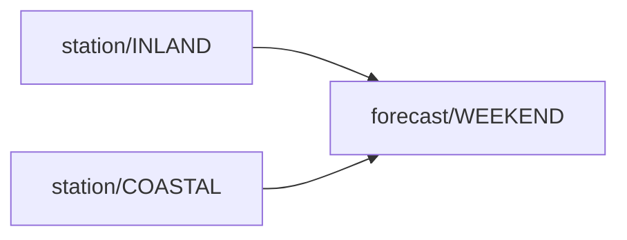

# `neuro-pil` architecture

This is the contract `neuro-pil` implements — precise enough for an independent, non-TypeScript
implementation to target byte-for-byte, not just "read the `.ts` files." The single highest risk of
a second implementation is two implementations' canonical hashes silently disagreeing on identical
input because their stringification rules differ in some undocumented detail — a hash mismatch
produces no error, just a silently wrong "stale" verdict. This doc exists to remove that risk.

Six things are specified here, in the order an implementer needs them: the node schema (§1
*Node/vault schema*), the hashing algorithm (§2 *Canonical hashing algorithm*), the stamp file that
stores its output (§2e *The stamp file*), the lint rules (§3a *The rule catalogue*), the diagram
format (§3b *Mermaid output*), and the boundary of the whole thing (§4 *Explicitly out of scope*).

## 1. Node/vault schema

A vault node is declared as YAML frontmatter on a `.md` file, or — for a folder-level manifest with
no accompanying prose — a bare `.neuro-pil.yml` file containing the same block directly, with no
`---` delimiters. `markdown.ts` is the reference parser; this section restates its contract in
language-neutral terms.

**Required fields:**

| Field  | Type                                    | Meaning |
|--------|------------------------------------------|---------|
| `node` | string                                   | The node's key. Globally unique within a vault. Not derived from the file's path or name — two files at different paths with the same `node` value collide, which the schema itself cannot prevent; `lint` reports it as `duplicate-key` (§3a *The rule catalogue*). |
| `kind` | one of `source`, `derived`, `leaf`, `projection` | See "Node kinds" below. |

A file (or `.neuro-pil.yml` manifest) missing either field is **not an error** — it is silently
excluded from the graph. A vault will always contain files that were never meant to be graph nodes
(a `README.md`, a legal PDF's sibling notes), and the schema treats "not a node" as the default
rather than requiring an explicit opt-out.

**Optional fields:**

| Field      | Type      | Default        | Meaning |
|------------|-----------|----------------|---------|
| `label`    | string    | the `node` value | Human-readable display name. |
| `inputs`   | string[]  | `[]`           | Keys of upstream nodes this one depends on. |
| `basis`    | string    | `""`           | The human sentence describing what this node is derived from. |
| `note`     | boolean   | `false`        | Marks commentary rather than evidence. A `note` node may only feed a `noteSink` node — never any other kind — and this flag never changes source-set membership: notes are invisible to §2 *Canonical hashing algorithm*. |
| `noteSink` | boolean   | `false`        | Marks the only kind of node allowed to consume a `note` node in its `inputs`. |

**Node kinds** (the `kind` field's four values):

- `source` — a leaf of the dependency graph with no `inputs` of its own; the raw datum everything
  else derives from. The unit §2 *Canonical hashing algorithm* keys off.
- `derived` — computed from one or more upstream nodes via `inputs`.
- `leaf` — a terminal node with no downstream consumers, otherwise structurally like `derived`.
- `projection` — a node explicitly **excluded from stamping** (§2d *Which nodes get hashed at all*): self-hashed
  out-of-band by its own consumer, never appearing in a stamp file this schema's tooling would
  compare against.

**Value encoding.** The frontmatter block supports exactly three shapes, each significant for a
portable implementation to replicate byte-for-byte:

- A scalar: `key: value`. `true`/`false` (unquoted) parse as booleans; anything else is a string,
  unquoted unless it needs to contain a `:` or leading/trailing whitespace, in which case single or
  double quotes are stripped (not YAML-escaped — no `\"` handling, no multi-line scalars).
- A flow list: `key: [a, b, c]`. Comma-split, each element unquoted the same way a scalar is.
- A block list: `key:` on its own line, followed by one or more `  - item` lines.

This is **deliberately not a general YAML parser** — no nesting beyond one list, no anchors, no
block scalars, no multi-document files. A vault whose frontmatter needs more than this is the signal
that a real YAML library has earned its keep, not a case this contract needs to anticipate.

## 2. Canonical hashing algorithm

This is the highest-risk piece to leave unwritten — the exact rule two independent implementations
must agree on bit-for-bit, or their "stale" verdicts silently diverge with no error raised on either
side.

### 2a. Deterministic stringification (`stableStringify`)

Given any JSON-compatible value:

- `null` or a non-object (string, number, boolean) → `JSON.stringify(value)` (standard JSON encoding
  — a string quoted and escaped per the JSON spec, a number in JSON's numeric literal form).
- An array → `[` + each element's `stableStringify`, comma-joined, + `]`. Order preserved — arrays
  are **not** sorted.
- An object (plain key/value map) → keys sorted lexicographically (byte/codepoint order, not
  locale-aware), then `{` + each `"key":value` pair, comma-joined, + `}`. A key whose value is
  `undefined` is **dropped entirely** — not emitted as `"key":null`, not emitted at all, and its
  comma does not appear. `null` itself, by contrast, **is** emitted (`null` is a value; `undefined`
  is an absent key).

No whitespace anywhere — no space after `:` or `,`, no trailing newline. This is the one property
most likely to be gotten "close enough" by a second implementation and then silently wrong: a
formatter that inserts `", "` instead of `","` produces a different byte string, and therefore a
different hash, for every value that has ever been correct.

**Worked examples** (computed against the current implementation, `canonical.ts`):

```
stableStringify({ b: 1, a: 2 })
  → {"a":2,"b":1}
```
(insertion order was `b` then `a`; output sorts keys, so `a` comes first)

```
stableStringify({ b: 1, a: undefined, c: [3, 2, 1] })
  → {"b":1,"c":[3,2,1]}
```
(`a` is dropped because its value is `undefined`; `c`'s array elements keep their given order, not
sorted; `b` sorts before `c` alphabetically, matching the sorted-key rule)

### 2b. What gets hashed for a given node — the source closure

A node's canonical string is **not** built from the node's own content directly. It is built from
**every `source`-kind node it transitively depends on** (its "source closure"): walk `inputs`
recursively from the target node, collect every reachable node whose `kind` is `source`, include the
node itself if it is itself a `source`, sort the resulting key list lexicographically. This is why a
`derived` node's hash changes when any upstream `source` changes, and — critically — does **not**
change when an upstream `derived`/`leaf` node's *shape* changes without its own upstream sources
changing (the derivation logic is not part of what's hashed; only the raw inputs are).

Given a subject (whatever raw-data structure the host defines) and a "slice map" (one function per
`source` node key, extracting that node's own raw datum from the subject): build a plain object
keyed by every key in the node's source closure, each value obtained by calling that key's slice
function against the subject (a source key with no slice function contributes `undefined`, which
§2a *Deterministic stringification* then drops — this is a silent gap, not an error; see §4
*Explicitly out of scope*). Canonicalize that object via `stableStringify`. That string **is** the
node's canonical string.

**Worked example.** Two weather stations feed one weekend forecast. `station/COASTAL` and
`station/INLAND` are both `source` nodes; `forecast/WEEKEND` is `derived` with
`inputs: [station/INLAND, station/COASTAL]`; the slice for each source node returns that node's own
raw file text verbatim. This is the actual reference fixture
(`tests/fixtures/synthetic-vault/`), not a redrawn simplification — `tsx cli.ts mermaid
tests/fixtures/synthetic-vault` produces exactly this:



```
canonicalFor(..., "station/COASTAL")
  = {"station/COASTAL":"---\nnode: station/COASTAL\nkind: source\nbasis: \"Raw hourly readings from the coastal station.\"\n---\n\n# Coastal station\n\nwind 18kt, gusting 30\n"}

canonicalFor(..., "station/INLAND")
  = {"station/INLAND":"---\nnode: station/INLAND\nkind: source\nbasis: \"Raw hourly readings from the inland station.\"\n---\n\n# Inland station\n\nwind 6kt, steady\n"}

canonicalFor(..., "forecast/WEEKEND")
  = {"station/COASTAL":"---\nnode: station/COASTAL\nkind: source\nbasis: \"Raw hourly readings from the coastal station.\"\n---\n\n# Coastal station\n\nwind 18kt, gusting 30\n","station/INLAND":"---\nnode: station/INLAND\nkind: source\nbasis: \"Raw hourly readings from the inland station.\"\n---\n\n# Inland station\n\nwind 6kt, steady\n"}
```

Two things this example is chosen to pin down. `forecast/WEEKEND`'s canonical string contains
**both** sources even though it is neither: its hash is entirely a function of its transitive
sources' raw content, never its own frontmatter or its own prose. And the two keys appear
**sorted** — `station/COASTAL` first — while the file declares `inputs: [station/INLAND,
station/COASTAL]` in the opposite order. An implementation that emitted declaration order would
produce a different byte string here, and therefore a different hash, while looking correct on any
fixture whose declaration order happens to already be sorted.

### 2c. The hash itself (`sha256hex12`)

`sha256hex12(str)` = the first 12 hex characters of `SHA-256(str)`, where `str` is UTF-8 encoded
before hashing and the digest is rendered as lowercase hex before truncation. Continuing the worked
example above:

```
sha256hex12(canonicalFor(..., "station/COASTAL"))   = c7e4bf80da45
sha256hex12(canonicalFor(..., "station/INLAND"))    = bf777bb2d513
sha256hex12(canonicalFor(..., "forecast/WEEKEND"))  = cd7f0a884f4c
```

Truncation to 12 hex characters (48 bits) is a deliberate collision-risk tradeoff for a stamp file
meant to be human-skimmable, not a cryptographic commitment — a portable implementation must
truncate to exactly 12 characters, not round to a different byte boundary that happens to look
similar (e.g. 6 bytes vs. 6.5).

The reference implementation ships this function twice, and a port targeting more than one runtime
will have to as well: `hash-node.ts` returns a `string` via `node:crypto`, `hash-web.ts` returns a
`Promise<string>` via `SubtleCrypto`, which has no synchronous digest. Same bytes in, same 12
characters out — only the signature differs, and they are kept in separate modules so nothing
running in a browser or a Cloudflare Pages Function pulls in `node:crypto`.

### 2d. Which nodes get hashed at all — `isStamped`

Every node whose `kind` is **not** `projection` is "stamped": it appears as a key in the hash map a
`stale` check computes and compares. `projection` nodes are excluded entirely — never hashed by this
mechanism, never appearing in a stamp file. (This means `source` nodes themselves are hashed too,
each against a trivial one-node source closure containing only itself — see `station/COASTAL` and
`station/INLAND` above, which each hash against a canonical string containing exactly their own raw
text.)

### 2e. The stamp file

The stamp is where a previous run's hashes are stored, and it is the only persistent state the
algorithm has. Its bytes are part of this contract: an implementation that reads a stamp written by
another must agree on the format exactly, or every node reads as drifted on the first cross-tool
run.

- **Path:** `<vault dir>/.neuro-pil/stamp.json`. The directory is created if absent.
- **Content:** a flat JSON object, node key → the node's `sha256hex12` (§2c *The hash itself*),
  covering **every** node for which §2d *Which nodes get hashed at all* returns true. Serialized
  with two-space indentation and a **trailing newline** — `JSON.stringify(hashes, null, 2) + "\n"`.
  Unlike the canonical string, this file is meant to be read and diffed by a human, which is why it
  is pretty-printed; nothing hashes it, so the whitespace is free.
- **When it is written:** only when the caller explicitly asks (`stale --update`). A `stale` run
  without that flag is read-only, and a first run against a vault with no stamp reports "no prior
  stamp" rather than silently creating one.
- **How it is compared:** for each key in the freshly computed map, drifted if its value differs
  from the stored one. A key **absent** from the stored stamp counts as drifted — that is how a
  newly added node is reported rather than ignored. A key present in the stamp but absent from the
  fresh map (a deleted node) is **not** reported: the comparison iterates the fresh map, not the
  stored one.

The stamp directory is skipped by the vault walk, along with every other dotfile and
`node_modules`, so a stamp can never accidentally become a node.

## 3. CLI contract

`cli.ts`'s `lint`/`mermaid`/`stale` subcommands, their flags, exact stdout/stderr shapes, and exit
codes are fully specified by two artifacts:

- **[`README.md`](README.md)'s "CLI usage" section** — usage lines, every flag,
  every output string template, and the exit-code table (`0` clean, `1` findings/drift present, `2`
  usage error).
- **`tests/cli.test.ts`** pins the exported surface — `parseArgs`, `runLint`, `runMermaid`,
  `runStale`, and `stale`'s output via `staleLines` — with exact-string assertions against real files
  on disk, so a second implementation has a literal string or object shape to reproduce. `main()`
  itself is not exercised: `lint` and `mermaid`'s output templates, and every exit code, live only in
  the README's spec above. That gap is how `stale --update` shipped printing no drift while still
  exiting 1.

What those two artifacts specify is the *shape* of a line — `[${rule}] ${node}: ${message}`. The
two subsections below specify what fills it in, which nothing else records.

### 3a. The rule catalogue

Every finding `lint` can emit. `rule` and `message` are both part of the contract: the message
strings are what a human reads, and the rule names are what a machine filters on, so a port that
invents its own wording produces output no shared tooling can consume.

| Rule | Emitted when | `message` |
|------|--------------|-----------|
| `duplicate-key` | two nodes share a `node` value | `duplicate node key "<key>"` |
| `unknown-input` | an `inputs` entry names no declared node | `"<key>" lists unknown input "<dep>"` |
| `source-has-inputs` | a `source` node declares any `inputs` | `source node "<key>" declares inputs — sources are raw, never derived` |
| `cycle` | a node reaches itself by following `inputs` | `cycle: <a> -> <b> -> <a>` (the actual path, arrow-joined, first node repeated last) |
| `orphan` | a `source` node nothing lists as an input | `"<key>" (source) is consumed by nothing — collected but never read by anything downstream` |
| `note-feeds-non-sink` | a node consumes a `note` node without being a `noteSink` | `"<key>" consumes note "<dep>" but isn't a noteSink — notes must never become evidence` |
| `missing-slice` | a `source` has no slice function | `source "<key>" has no matching slice function` |
| `missing-slice` | a slice function matches no `source` | `slice "<key>" doesn't match any source node` |

Three constraints a port has to honour beyond the strings. `orphan` fires **only** for `kind:
source` — a `derived` or `leaf` node with no consumers is legitimately terminal (a report section
shown straight to the user), so flagging those would false-positive on every run — and it is
suppressed for any key in the caller's `terminalAllowlist`. `missing-slice` is the one rule needing a
host's slice map rather than the graph alone, so it lives in a separate entry point and the vault
CLI never runs it: a markdown vault has no analogue of a slice map. And `cycle` is reported once
per node on the cycle, not once per cycle, so a two-node loop yields two findings.

### 3b. Mermaid output

The diagram format, which nothing else in this repo writes down:

```
graph LR
  <key>["<label>"]        one line per node, in declaration order
  <dep> --> <key>         one line per edge, node order then input order
```

Two-space indent on every line but the first; no trailing newline. The renderer reads **only**
`key`, `label` and `inputs` — never `kind` — so renaming a `source` to a `derived` leaves the
diagram byte-identical, and the picture can never encode a distinction the hash does not.

Written into a document, the block is delimited by `<!-- DAG:START -->` and `<!-- DAG:END -->`, and
the writer replaces everything between them with exactly:

```
<!-- DAG:START -->\n\n```mermaid\n<render>\n```\n\n<!-- DAG:END -->
```

A document missing either marker is an **error**, not a no-op — silently writing nothing into a doc
that was never wired up is how a diagram drifts from the graph it claims to show.

### 3c. Conformance vectors, sketched

Lifting all of the above into a language-neutral format — a JSON fixture set of the shape
`{ "files": { "<path>": "<raw text>" }, "expect": { "lint": [...], "hashes": {...} } }` so a Python
or Go test runner could consume the same vectors a `vitest` run consumes today — is sketched but not
built: `tests/fixtures/synthetic-vault/` is already exactly the input half of such a vector; only the
expected-output half would need extracting from `cli.test.ts`'s assertions into data.

## 4. Explicitly out of scope

- What a graph *containing* a node-key collision means. Two files declaring the same `node` value are
  reported by `lint` (§3a *The rule catalogue*'s `duplicate-key`), but nothing rejects them: the
  parser emits both, so the key appears twice in the node list while any lookup by key resolves to
  one of them. Which one is unspecified, and a portable implementation is not required to match it —
  the contract's answer is that the vault is invalid, and `lint` is where you find that out.
- Closing the "silent gap" noted in §2b *What gets hashed for a given node* (an unknown source key
  contributing `undefined` rather than raising) — that is `missing-slice`'s job, at lint time, in
  the host language; it is not part of the hashing contract itself, and a portable implementation is
  not required to reproduce it, only the hash.
- A second-language implementation itself, and the conformance-vector suite sketched in §3c
  *Conformance vectors* — this doc records the shape that work would take, not a commitment to
  build it.
- **Anything downstream of the library.** No UI, no storage, no PII or PHI handling: those belong to
  whoever adopts it, in the product they build around it.
- **A graph database, or an interactive visual explorer.** `neuro-pil`'s graph is *declared* — in
  code (`defineDag`) or vault frontmatter (`dagFromFiles`) — so a host already knows its own node
  keys, and Neo4j, Cytoscape.js and Gephi are all built for the opposite case: querying and browsing
  a graph whose shape you don't yet know. §3b *Mermaid output* is the whole of what this package
  renders, and mermaid's readability ceiling — comfortably dozens of nodes, not thousands — is the
  practical limit of it. A deployment that outgrows that would export a `Dag`'s nodes and edges into
  one of those tools as a one-way, read-only projection; nothing here does so today, and nothing is
  planned until a real deployment needs it.

## Lineage

Not a novel idea: it's incremental computation over a content-addressed dependency graph — the
Bazel/Nix/Make lineage, self-adjusting computation in the PL literature — with an expensive
derivation step (an LLM call, here) standing in for a compiler invocation as the build rule.
[`../README.md`](../README.md) argues the position these works place `neuro-pil` in; this list is the bibliography.

**Citation convention.** Author order, title and pagination are as registered at Crossref. The
identifier closes each entry as plain text, and the only hyperlink is the DOI resolver — a DOI
outlives whatever site happens to serve the PDF today. **A work with no DOI is left unlinked**, citing
a durable identifier instead: a repository handle, a technical-report number, a long-stable URL.
Software projects are named in prose rather than cited here; they are not works and have no fixed
version.

- **Derivability** — E. F. Codd, "A Relational Model of Data for Large Shared Data Banks", *CACM*
  13(6), 1970, pp. 377-387. DOI [10.1145/362384.362685](https://doi.org/10.1145/362384.362685).
  §2.2 *Redundancy* defines derivability — a derived relation is a function of exactly the relations
  it came from — and §2.3 *Consistency* supplies the constraint: an information system lacking
  semantic detail about a named relation "cannot deduce the redundancies applicable to the named
  set", so the derivations must be declared. That is the distinction `neuro-pil` draws between a
  `source` node and a `derived` node, and the reason its edges are declared rather than inferred.
  (Codd's own consistency check re-evaluates the derivation and compares extensions, which is exactly
  what `neuro-pil` refuses to do; note also that "view" in the 1970 paper means *worldview* — the
  relational view of data, as against the network view — not a named derived query, which arrives
  with Codd 1971 and System R.)
- **Make** — Stuart I. Feldman, "Make — A Program for Maintaining Computer Programs", *Software:
  Practice and Experience* 9(4), 1979, pp. 255-265. DOI
  [10.1002/spe.4380090402](https://doi.org/10.1002/spe.4380090402). The original
  declared-dependency, rebuild-what's-stale build tool; `dag.ts`'s
  `sourceClosureOf`/`upstreamOf`/`downstreamOf` play the same role a Makefile's dependency graph
  does.
- **Make's blind spot** — D. J. Bernstein, "Target files depend on build scripts".
  `cr.yp.to/redo/honest-script.html` — no DOI; archived in the Wayback Machine since 2003. The
  diagnosis `neuro-pil` inherits deliberately: a tool comparing only input timestamps cannot see a
  changed build instruction. Bernstein declines the fix as well as naming the defect, which is why
  this is a design fork rather than a bug report.
- **Hashing the instruction** — Allan Heydon, Roy Levin, Yuan Yu, "Caching Function Calls Using
  Precise Dependencies", *PLDI* 2000, pp. 311-320. DOI
  [10.1145/349299.349341](https://doi.org/10.1145/349299.349341). Vesta's cache key fingerprints the
  function's *body* together with its arguments — the step `neuro-pil` declines to take. (The system
  is Vesta; the title above is the registered one.)
- **Hashing the closure** — Eelco Dolstra, *The Purely Functional Software Deployment Model*, PhD
  thesis, Utrecht University, 2006. No DOI; Utrecht DSpace handle 1874/7540. Nix serializes a
  derivation to a canonical form whose fields include `builder` and `args`, and hashes those bytes,
  so a change anywhere in the transitive closure yields a different store path by construction rather
  than by a traversal that has to be gotten right. The closest structural ancestor of
  `canonical.ts`'s hash-the-inputs, report-on-mismatch mechanism — minus the
  `builder`/`args` fields, which is precisely what this package trades away.
- **Self-adjusting computation** — Umut A. Acar, *Self-Adjusting Computation*, PhD thesis,
  CMU-CS-05-129, Carnegie Mellon University, 2005 (no DOI); and Umut A. Acar, Guy E. Blelloch,
  Robert Harper, "Adaptive Functional Programming", *POPL* 2002, pp. 247-259, DOI
  [10.1145/503272.503296](https://doi.org/10.1145/503272.503296), extended as *TOPLAS* 28(6), 2006,
  pp. 990-1034, DOI [10.1145/1186632.1186634](https://doi.org/10.1145/1186632.1186634). The
  PL-theory foundation for recomputing exactly the part of a derived result a specific input change
  invalidates — the *motivation* `neuro-pil` borrows. It does not borrow the mechanism: change
  propagation re-executes and compares outputs, which is what lets it stop early when a result turns
  out unchanged. `neuro-pil` never re-executes, so it has no early cutoff and over-approximates
  instead.
- **Adapton** — Matthew A. Hammer, Yit Phang Khoo, Michael Hicks, Jeffrey S. Foster, "Adapton:
  Composable, Demand-Driven Incremental Computation", *PLDI* 2014, pp. 156-166. DOI
  [10.1145/2594291.2594324](https://doi.org/10.1145/2594291.2594324). A later framework in the same
  lineage. (ACM renders the second author surname-first, as "Khoo Yit Phang"; the given-family order
  used here follows dblp and his co-authors, and matches the rest of this list.)
- **The taxonomy** — Andrey Mokhov, Neil Mitchell, Simon Peyton Jones, "Build Systems à la Carte",
  *PACMPL* 2(ICFP), Article 79, 2018. DOI [10.1145/3236774](https://doi.org/10.1145/3236774).
  Extended as "Build Systems à la Carte: Theory and Practice", *JFP* 30, e11, 2020, DOI
  [10.1017/S0956796820000088](https://doi.org/10.1017/S0956796820000088). Decomposes a build system
  into a *scheduler* (§4.1 *The Scheduler: Respecting the Dependency Order*) and a *rebuilder*
  (§4.2 *The Rebuilder: Determining Out-of-date Keys*) — the vocabulary [`../README.md`](../README.md) uses to place
  this package. `canonicalFor` is a verifying trace in their sense; §3.6 *Correctness of a Build
  System* defines correct by recomputing a key and checking it against the store, which is exactly
  the test `neuro-pil` structurally cannot be evaluated against.

**Software referenced in prose, not cited as works:** Bazel (bazel.build), Nix (nixos.org), Salsa
(github.com/salsa-rs/salsa — the incremental-computation engine underlying `rust-analyzer`, which
tracks revisions, durability and runtime-observed dependencies, and *backdates* a value whose
recomputed output is unchanged), and Adapton's project page. Their documentation is versioned and
moves; where a specific behaviour matters, it is attributed to the project's own manual in prose
rather than pinned to a URL that will rot.

Cited as the lineage this package's design draws on, not as a claim that `neuro-pil` implements any
of them, or that reading them is required to use it.
