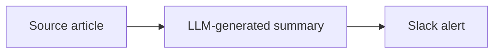
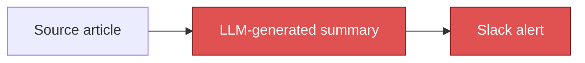

# `@pablotech/neuro-pil`

*Greek νεῦρον, sinew or cord, plus πῖλος, felted wool — **nerve felt**, the tangled mesh between
nerve cell bodies where most synaptic connection happens. It is the connections, not the cell
bodies, that do the computing. That is the whole design position: this package models the edges and
never looks inside a node.*

**Staleness is a property you compute from the graph, not one anyone remembers to assert.** Declare
what a value was derived from, and this package tells you when the evidence under it has moved — by
hashing each node's transitive sources and comparing against a recorded stamp.

The trade that buys is deliberate and worth knowing up front: a node's stamp is a function of its
sources' raw content and **nothing else** — never its own text, never the reasoning that produced
it. So this engine works identically whether the derivation was a build step, a spreadsheet formula
or a model call it could never re-run. What it cannot tell you is that a conclusion went bad on its
own. Evidence moving is the only thing it detects.

Concretely, in the shape the tutorial below builds from an empty directory in ten minutes: two weather
stations feed one weekend forecast. Change a station's readings and the forecast goes stale. Change
the forecast's own prose and **nothing** does — it is downstream, not evidence. Staleness has a
direction, and that is the idea worth having in your hands rather than in your head.

Nothing here is clinical, and nothing here knows what a prompt is. A graph over weather stations
(the tutorial below), invoices or build artifacts is as valid a consumer as the lab-marker graph
that motivated it. The [repo README](../README.md) states the position in two sentences and this page argues it
at length below;
[`ARCHITECTURE.md`](ARCHITECTURE.md) is the byte-level contract — schema, canonical-hashing
algorithm, CLI, and academic lineage.

## Tutorial — a vault from scratch

Ten minutes, no TypeScript. This walks the **vault** front-end: a directory of plain markdown files
that declare a graph in their frontmatter, which is the path a consumer with no toolchain takes.
([The other front-end, a compiled TypeScript manifest, is worked below](#example--the-typescript-manifest-front-end).)

The worked graph: two weather stations feed one weekend forecast. Edit a station's readings and the
forecast should go stale. Edit the forecast's own prose and nothing should — it is downstream, not
evidence.

### 1. Declare three nodes

Anywhere on disk, make a directory and three files. Each node is a `.md` file whose frontmatter
carries a `node` key and a `kind`; the prose below the frontmatter is yours.

```
vault/
  station/COASTAL.md
  station/INLAND.md
  forecast/WEEKEND.md
```

```markdown
---
node: station/COASTAL
kind: source
basis: "Raw hourly readings from the coastal station."
---

# Coastal station

wind 18kt, gusting 30
```

`station/INLAND.md` is the same shape (`wind 6kt, steady`). The forecast declares what it reads:

```markdown
---
node: forecast/WEEKEND
kind: derived
inputs: [station/INLAND, station/COASTAL]
basis: "Weekend forecast written across the inland and coastal readings."
---

# Weekend forecast

Small-craft advisory on the coast; inland stays calm.
```

`kind: source` means raw evidence — a leaf with no inputs of its own. `kind: derived` means written
from other nodes, named in `inputs`. `basis` is the human sentence saying *why* those inputs; it is
never parsed for meaning, only carried.

Any file without both `node` and `kind` is silently skipped rather than rejected — a `README.md`
next to your nodes is not an error, because a real vault is mostly files that were never meant to be
graph nodes.

### 2. Check the graph holds together — `lint`

```console
$ npx tsx cli.ts lint vault
neuro-pil: no findings across 3 nodes.        # exit 0
```

Break it on purpose. Repoint the forecast from `station/COASTAL` to a `station/BUOY` you never
wrote:

```console
$ npx tsx cli.ts lint vault
[unknown-input] forecast/WEEKEND: "forecast/WEEKEND" lists unknown input "station/BUOY"
[orphan] station/COASTAL: "station/COASTAL" (source) is consumed by nothing — collected but never read by anything downstream
                                              # exit 1
```

Two findings from one edit, and the second is the interesting one: `station/COASTAL` is still a
perfectly valid node, but nothing reads it any more, so the evidence you are still collecting no
longer reaches any conclusion. `orphan` fires only for `source` nodes — a `derived` node with no
consumers is legitimately terminal.

Those are two of seven rules; the others cover cycles, duplicate keys, a `source` that declares
inputs, and a note used as evidence. The full catalogue with exact message strings is
[`ARCHITECTURE.md`](ARCHITECTURE.md) §3a *The rule catalogue*.

### 3. See it — `mermaid`

```console
$ npx tsx cli.ts mermaid vault
graph LR
  forecast/WEEKEND["forecast/WEEKEND"]
  station/COASTAL["station/COASTAL"]
  station/INLAND["station/INLAND"]
  station/INLAND --> forecast/WEEKEND
  station/COASTAL --> forecast/WEEKEND
```

`--write <path>` instead rewrites the fenced block between `<!-- DAG:START -->` and
`<!-- DAG:END -->` markers in that file, so a diagram checked into a doc is regenerated rather than
hand-maintained, and can never drift from the graph.

### 4. Record a baseline — `stale --update`

`stale` is read-only by default. A first run has nothing to compare against and says so, without
writing anything:

```console
$ npx tsx cli.ts stale vault
no prior stamp — nothing to compare.          # exit 0
```

Pass `--update` to record the current state:

```console
$ npx tsx cli.ts stale vault --update
no prior stamp — nothing to compare.
Wrote stamp for 3 nodes into vault/.neuro-pil/stamp.json
                                              # exit 0
```

```json
{
  "forecast/WEEKEND": "cd7f0a884f4c",
  "station/COASTAL": "c7e4bf80da45",
  "station/INLAND": "bf777bb2d513"
}
```

### 5. Change the evidence

The wind picks up. Edit `station/COASTAL.md`'s `18kt` to `22kt`, and ask again:

```console
$ npx tsx cli.ts stale vault
[stale] forecast/WEEKEND
[stale] station/COASTAL                       # exit 1
```

Two nodes, and both are right. `station/COASTAL` changed. `forecast/WEEKEND` did not change — but it
was *written from* something that did, so whatever it says about the weekend was reasoned from
readings that no longer hold. `station/INLAND` is untouched and stays silent.

The exit code is the point: wire `stale` into CI and a commit that edits evidence without revisiting
what was derived from it fails the build.

### 6. Now change the forecast's prose

Put the coastal reading back, re-stamp, then rewrite `forecast/WEEKEND.md`'s body — not its
frontmatter — into something completely different:

```console
$ npx tsx cli.ts stale vault
neuro-pil: no drift across 3 stamped nodes.   # exit 0
```

Nothing moved. A derived node's stamp is a function of its transitive *sources'* raw content and nothing else:
never its own text, never the reasoning that produced it. That is the whole trade this engine makes,
and [`../README.md`](../README.md) argues it at length. Rewording a conclusion is not new evidence,
so it does not mark anything stale — and equally, this engine cannot tell you that a *conclusion* went
bad on its own.

### 7. Script it — `--json`

Every subcommand takes `--json` and prints one line of machine-readable result instead of the prose
above:

```console
$ npx tsx cli.ts stale vault --json
{"baseline":false,"drifted":["forecast/WEEKEND","station/COASTAL"],"nodeCount":3,"updated":false}
```

Exit codes are the contract: `0` clean, `1` findings or drift present, `2` usage error.

## Two front-ends over the same `Dag` type

- **TypeScript manifest** — `defineDag` (`dag.ts`), consumed via the package root `index.ts`. A
  compiled, statically-typed graph, for a consumer that shares the same toolchain.
- **Plain-markdown vault** — `dagFromFiles` (`markdown.ts`), for a consumer with no toolchain at
  all. Nodes are declared as YAML frontmatter on `.md` files, or a bare `.neuro-pil.yml` folder
  manifest. `cli.ts` is the example front-end, and the tutorial above.

Both produce the same `Dag`, so `validate`, `renderMermaid`, `canonicalFor`/`driftedKeys`, etc.
work identically regardless of which front-end built the graph.

## Example — the TypeScript manifest front-end

### Scenario

Say you have a source document and an LLM-generated summary of it. The summary is expensive — every
regeneration is a real API call, real seconds, real money — and every time the source document
changes, the summary might now be wrong.

### Before: two options, both fail

- **Always regenerate.** Every time anything touches the document, call the model again, just in
  case. Correct, but wasteful — you're paying the expensive cost on every edit, including the ones
  that didn't touch anything the summary actually depends on.
- **Cache it, and trust something to invalidate the cache.** A TTL. A "regenerate" button someone has
  to remember to click. A code comment that says *remember to rerun this if the document changes*.
  Cheap, but now correctness depends on a human (or a timer) remembering — and the failure mode is
  silent: a stale summary sits right next to a changed document with nothing distinguishing it from a
  fresh one.

Both options fail at the same job: detecting staleness without either paying to regenerate on every
edit or trusting a human to notice. You shouldn't have to choose between paying the expensive cost
unnecessarily and trusting someone's memory.

### After: ask the graph

```ts
import { defineDag, canonicalFor, driftedKeys } from "@pablotech/neuro-pil";

// The expensive derivation. In production this is an LLM call — money and
// seconds per run. It is never called just to check whether it's still valid.
function expensiveSummarize(text: string): string {
  console.log("  calling the model to summarize... (this costs money)");
  return `Summary: ${text.split(" ").length} words.`;
}

const dag = defineDag([
  { key: "article", label: "Source article", kind: "source", inputs: [],
    basis: "The raw document text." },
  { key: "summary", label: "LLM-generated summary", kind: "derived", inputs: ["article"],
    basis: "expensiveSummarize(article)" },
  { key: "alert", label: "Slack alert", kind: "derived", inputs: ["summary"],
    basis: "buildAlert(summary)" },
]);

let articleText = "Storms are expected across the coast this weekend.";
const slices = { article: () => articleText };
```

The graph, rendered by `renderMermaid(dag)`:



**Produce the summary once, and keep only its stamp** — not the summary itself, just enough to detect
staleness later. Stamp `alert` too:

```ts
const summary = expensiveSummarize(articleText); // -> "calling the model..." (paid once)
const stamp = {
  summary: canonicalFor(dag, {}, slices, "summary"),
  alert: canonicalFor(dag, {}, slices, "alert"),
};
```

Time passes. Someone edits the article:

```ts
articleText = "Storms are expected across the coast this weekend and into Monday.";
```

**Before regenerating anything, ask the graph which nodes are stale** — no model call involved:

```ts
const now = {
  summary: canonicalFor(dag, {}, slices, "summary"),
  alert: canonicalFor(dag, {}, slices, "alert"),
};
driftedKeys(now, stamp); // -> ["summary", "alert"]
```

**Both `summary` and `alert` come back stale — not just `summary`.**

`alert`'s own definition (`buildAlert(summary)`) never mentions `article`. But `canonicalFor` doesn't
hash a node's direct input — it hashes a node's **source closure**: every `source` node it transitively
depends on, no matter how many derived nodes sit in between. `alert`'s source closure is `{article}`,
the same closure `summary` has, because `alert` → `summary` → `article` is one connected chain. That's
how the graph found `article` from `alert`, which never named it.

- **The saving.** Nobody wrote that chain down by hand. `alert`'s owner added no check for `article`.
  If `summary` ever gains a second source, `alert` doesn't need a matching update either — the graph
  walks the chain itself, at any depth.
- **Why `summary` and `alert` hash identically above.** Same reason: they share the same source
  closure, `{article}`. A node's hash is a function of its source closure alone, never its own identity
  or logic — give `alert` a second source of its own and it gets its own, different hash.

Only now, knowing for certain both are stale, would you pay to regenerate them — the same graph, with
the two keys `driftedKeys` reported marked in red:



Now run the same check *without* editing the article first. `driftedKeys` returns `[]` — nothing is
stale, and you know it without spending a single call to find out.

### The point

- Staleness is computed from the graph, not remembered by a person. It stays correct no matter how
  many hops a node sits from the source it depends on.
- The expensive step (`expensiveSummarize`) never runs in order to *check* staleness. Only
  `canonicalFor` does, over each node's source closure — no model call at any depth.
  *Measured:* the check itself grows **quadratically with depth** — `sourceClosureOf` walks upstream
  once per node without memoizing. It stays orders of magnitude cheaper than a model call, but a
  deep chain is where it stops being cheap against itself
  ([`BENCHMARKS.md`](../BENCHMARKS.md#deterministic--neuro-pil)).
- Both answers are worth having. "Stale, regenerate it" and "not stale, reuse it" each come from the
  graph, structurally, every time.

## Declaring the prompt as a source node

The engine's blind spot is that it never looks inside a derivation. If a value was produced by a
model call, editing the prompt changes the value — and nothing in the graph moved, so nothing goes
stale. The fix is not to teach the engine about prompts. It is to declare the prompt as evidence,
because that is exactly what it is.

This is also how a [brain](../README.md#what-this-is-for)'s version key gets into the graph: a prompt
plus the model that answered it *is* the version, and declaring it as a source is what buys back the
one blind spot this engine otherwise accepts by design.

```markdown
---
node: prompt/FORECAST-TEMPLATE
kind: source
basis: "The template the forecast is written from. Edit it and every forecast is out of date."
---

Summarize the weekend outlook from the station readings below. Lead with any advisory.
```

Then list it alongside the readings:

```yaml
node: forecast/WEEKEND
kind: derived
inputs: [station/INLAND, station/COASTAL, prompt/FORECAST-TEMPLATE]
```

Now `stale` fires on a prompt edit exactly as it does on a reading change, and it fires on precisely
the derived nodes that named that template — not on every node in the vault. Add the model
identifier as a second source node (`model/OPUS-5`, whose body is the version string) and a model
upgrade stales its outputs the same way.

Nothing about this is a special case in the code. The engine still knows nothing about prompts; it
hashes a source's bytes and reports what moved. Declaring the prompt is just being honest about what
the conclusion was derived from — which is the only thing this engine ever asks of you.

## Scoring competing versions — `compareBrains`

A **brain**, in the sense the [repo README defines](../README.md#what-this-is-for), is a named,
versioned unit of reasoning — a prompt, a model, a schema and an audience. This is the function that
lets you replace one with a better one on evidence, and it is the only place this package admits a
derivation might be a model call at all.

Staleness says a value should be revisited. It cannot say whether the new one is *better* — for a
model call, nothing structural can. `compare.ts` is the one concession to that: run competing
versions over a fixed case set, score each result, compare the means.

```ts
import { compareBrains } from "@pablotech/neuro-pil/compare";

const { perVersion } = await compareBrains(
  cases,                      // a fixed set — the point is that it does not move between runs
  ["v3-terse", "v4-explicit"],
  (testCase, version) => runMyPrompt(version, testCase),   // your model call
  (result, testCase) => gradeIt(result, testCase),         // your rubric: any number
);

for (const { version, mean, scores } of perVersion) {
  console.log(version, mean.toFixed(2), scores);
}
```

`Case`, `Version` and `Result` are opaque type parameters — the package never inspects any of them —
and `run` and `score` are the entire extension surface. A version is a value you choose: a prompt
string, a model identifier, a config object, a function.

What it deliberately is **not**: it does not call a provider, store runs, track cost, or version your
prompts. It is roughly forty lines, and it is not trying to be PromptLayer, Langfuse, Portkey,
Helicone or MLflow — if you already run one of those, keep it. This exists so that promoting a
prompt version is an act with evidence behind it even in a repo that runs none of them, and so that
the same fixed-case discipline the golden fixtures apply to prompt *text* can be applied to prompt
*quality*.

The example above is hypothetical, because this package is domain-free and acquiring a clinical case
set to demonstrate its own API would defeat the point. A real run of it exists a directory away:
`akesi-pil/benchmarks/` holds twelve cases and two competing retry strategies, and
[`BENCHMARKS.md`](../BENCHMARKS.md#sampled--akesi-pil) reports what came back: every attempt
passed on the first try, so the two strategies sent identical prompts and scored identically. Note
where the four lines that call `compareBrains` live: in neither package, because neither imports
the other.

## Importing

The package root is the **isomorphic** subset — safe in a browser bundle, a Cloudflare Pages
Function, or a `node:crypto` CLI alike. Anything runtime-specific is behind its own subpath, so
importing it is a deliberate act rather than something a bundler discovers for you:

| Import | From |
|--------|------|
| `defineDag`, `isStamped`, types `Dag` / `DagNode` / `NodeKind` | `@pablotech/neuro-pil` |
| `stableStringify`, `canonicalFor`, `canonicalMap`, `driftedKeys` | `@pablotech/neuro-pil` |
| `validate`, `sliceParity`, types `Finding` / `ValidateOptions` | `@pablotech/neuro-pil` |
| `renderMermaid`, `extractDagBlock`, `writeDagBlock`, `DEFAULT_MERMAID_MARKERS` | `@pablotech/neuro-pil` |
| `sha256hex12` → `string` | `@pablotech/neuro-pil/hash-node` |
| `sha256hex12` → `Promise<string>` | `@pablotech/neuro-pil/hash-web` |
| `dagFromFiles`, `parseVaultNode`, `extractFrontmatter`, `parseFrontmatterBlock` | `@pablotech/neuro-pil/markdown` |
| `compareBrains` (async), types `Comparison` / `VersionScore` | `@pablotech/neuro-pil/compare` |

Two things that catch people. `sha256hex12` is **synchronous** in `hash-node` and **asynchronous**
in `hash-web` — `SubtleCrypto` has no sync digest — so the two are not drop-in substitutes even
though they produce identical bytes. And `sourceClosureOf`, `upstreamOf` and `downstreamOf` are
**methods on the `Dag` object** returned by `defineDag`/`dagFromFiles`, not importable functions:
call `dag.sourceClosureOf(key)`.

## Module map

- `dag.ts` — the `Dag`/`DagNode` shape, `defineDag`, `isStamped`.
- `canonical.ts` — deterministic (sorted-key) JSON stringification and the per-node canonical
  hashing input (`canonicalFor`, `canonicalMap`, `driftedKeys`).
- `validate.ts` — structural graph checks (cycles, unknown inputs, orphan sources, note-sink
  rules) plus `sliceParity`, the one check that needs a host's slice map.
- `mermaid.ts` — renders a `Dag` to a mermaid diagram, and reads/writes a fenced block between
  markers in a doc.
- `markdown.ts` — the vault-mode front-end: frontmatter parsing and `dagFromFiles`.
- `hash-node.ts` / `hash-web.ts` — the same truncated-SHA-256 hash, `node:crypto` and
  `SubtleCrypto` variants, kept separate so nothing that runs in a browser or a Cloudflare Pages
  Function pulls in `node:crypto`.
- `cli.ts` — subcommands over a vault directory (see CLI usage below), the CLI a non-code
  consumer, or an external invoker, runs directly via `tsx`.

## CLI usage

```
tsx cli.ts lint <dir> [--json]
tsx cli.ts mermaid <dir> [--write <path>]
tsx cli.ts stale <dir> [--update] [--json]
```

- `lint` — `validate(dagFromFiles(walkVault(dir)))`. No `sliceParity` — that check needs a host's
  slice map, and vault mode has no analogue for one. Clean: `neuro-pil: no findings across ${n}
  nodes.\n`, exit 0. Else: one line per finding, `[${rule}] ${node}: ${message}\n`, exit 1.
- `mermaid` — prints `renderMermaid(dagFromFiles(walkVault(dir)))` to stdout. `--write <path>`
  instead reads that file and rewrites its fenced `<!-- DAG:START -->`/`<!-- DAG:END -->` block in
  place, printing `Wrote ${n}-node mermaid into ${path}\n`.
- `stale` — hashes every stamped node (`canonicalFor` + `sha256hex12`, one slice per source node
  returning that node's own raw file text) and compares against `<dir>/.neuro-pil/stamp.json` via
  `driftedKeys`. **Read-only by default** — the stamp is written only when `--update` is passed.
  No prior stamp: `no prior stamp — nothing to compare.\n`, exit 0. Clean: `neuro-pil: no drift
  across ${n} stamped nodes.\n`, exit 0. Drift: one line per drifted key, `[stale] ${key}\n`, exit
  1. `--update` always (re-)writes the stamp to the freshly-computed hashes, after reporting
  whatever drift (if any) was found against the old one.
- `--json` (where supported) prints the subcommand's result object as one line of JSON instead of
  the human-readable text above.
- Exit codes: `0` clean, `1` findings/drift present, `2` usage error (bad dir, unknown subcommand,
  missing required arg).

## Lineage

Every system below answers one question: **what do you compare, when recomputing is too expensive to
do on every edit?** Fifty years of answers, differing mainly in how much of the *derivation* they fold
into the comparison. That axis is where `neuro-pil` sits.

**Codd** set the precondition in 1970. §2.2 *Redundancy* of *A Relational Model of Data for Large
Shared Data Banks* defines **derivability** — a relation obtainable from a set by operations that,
"for all time," yield it from members of that set. §2.3 *Consistency* then delivers the sentence
this library is built on: a system
lacking detailed semantic information about each named relation "cannot deduce the redundancies
applicable to the named set." **The graph must be declared; it cannot be inferred.** Codd's own
consistency check, though, re-evaluates the derivation and compares — he can afford to, because
relational algebra is cheap.

**Feldman's Make** (1979) is the first refusal to re-evaluate: compare *evidence* instead —
prerequisite modification times, pairwise along each edge. And Make does not look at the recipe.
Change `CFLAGS=-O` to `CFLAGS=-g`, type `make`, and nothing happens. **D. J. Bernstein** diagnosed it
in one line — "make has no idea that the target files depend on the Makefile" — then refused to call
it a bug: *"This isn't make's fault. The author simply has to be honest to make."* And he declined the
fix the next generation would adopt, because depending on the makefile rebuilds the documentation too,
as if someone "had fired a `make clean; make` bazooka." **The man who diagnosed the blind spot chose
to keep it.**

**Vesta** (Heydon, Levin and Yu, 2000) took the fix Bernstein declined. Its cache key is "the
fingerprint of the `compile` function's *body* combined with the fingerprint of the literal
`test.c`" — instruction and inputs, one hash. **Bazel** carries the idea into daily practice.

**Dolstra's Nix** (2006) sharpens it to the limit. A derivation is serialized to a canonical form
whose fields include `builder` and `args`, and *those bytes are what gets hashed* — builder, arguments
and the full transitive input closure, all inside one store path. Change anything upstream and the
path differs by construction, not by a traversal someone had to get right. **This is the closest
structural ancestor of `sourceClosureOf`.**

**Acar's self-adjusting computation** (2005) — with his *Adaptive Functional Programming*, joint with
Blelloch and Harper, three years before it, and **Hammer's Adapton** and **Salsa** after — takes the
other branch entirely:
don't declare the graph, *discover* it by watching an execution. That buys the one thing no hashing
scheme can: **early cutoff**. Re-run the query, notice the output didn't actually change, and stop.
Salsa calls its implementation **backdating** — stamp the value with the revision it last *really*
changed, and nothing downstream is disturbed.

**Mokhov, Mitchell and Peyton Jones** sorted the field onto two axes in *Build Systems à la Carte*
(ICFP 2018): a **scheduler** that orders the work, and a **rebuilder** that decides whether a key is
dirty. Make keeps a dirty bit; Bazel keeps constructive traces; Nix keeps *deep* constructive traces.
Every cell in their table is occupied by a system that can run its own build step.

Full citations, with DOIs, in [`ARCHITECTURE.md`](ARCHITECTURE.md#lineage).

## What this trades away

Each of the three claims below is measured on a generated corpus rather than left as prose —
including the one that counts against this library. The rates, and the mutation testing that shows
they would move if the engine stopped behaving, are in
[`BENCHMARKS.md`](../BENCHMARKS.md#deterministic--neuro-pil).

Read that history as one argument and this library is easy to place — and it is not an invention.
Three claims, and only the third is ours — it is the one the [repo README](../README.md) opens on, and the reason the
library exists rather than a concession it makes:

1. **The mechanism is Nix's, borrowed.** Hash the transitive closure, compare stamps, difference means
   stale. In Mokhov et al.'s vocabulary `canonicalFor` is a *verifying trace*: small hashes of what a
   key depended on. Nothing here is new.
2. **The exclusion is Make's, and it makes the system weaker.** `neuro-pil` hashes only *source*
   values; the derivation is not in the key. That is a subtraction from Vesta, Bazel and Nix, and it
   lands on precisely Bernstein's blind spot — a changed prompt marks nothing stale, exactly as a
   changed `CFLAGS` marked nothing stale.
3. **Only the reason is new, and it is a design position, not a result.** Every ancestor can fold the
   instruction into the key because the instruction is a function it owns and can *call again*. An LLM
   call is not. The same prompt and the same model produce different output, so re-running proves
   nothing about whether the cached answer is still good.

That third point is sharper in *Build Systems à la Carte*'s own terms than it sounds. Their `Task` is
a runnable function, and §3.6 *Correctness of a Build System* states the condition **by re-running
it**: "if we recompute the value of the key (using the task description, and the final store), we
should get exactly the same value as we see in the final store." A derivation that can never be
recomputed cannot be checked against that definition at all. So `neuro-pil` is not a worse cell in
their table — it is off the grid, and it forfeits what the grid buys. §6.5 *Self-tracking* arrives at
the same escape hatch from the other side: a build system in a full programming language faces "the
challenge of implementing equality on arbitrary task functions," so "the pessimistic assumption that
any change to the build system potentially changes any build task can often be used." For
`neuro-pil` that pessimism is not a fallback — it is the permanent condition.

**What it forfeits is early cutoff.** Acar, Adapton and Salsa re-run and discover nothing changed;
`neuro-pil` never re-runs, so it can only over-approximate — every stamp that moved is reported stale,
whether or not the answer would have differed. It keeps self-adjusting computation's *motivation*
(declare the dependencies once; let mechanics, not human memory, decide what is stale) while refusing
its *mechanism*. Put plainly: **`neuro-pil` is Nix's closure hash with Make's blind spot, and the
blind spot is deliberate.**

**Validity is not reproducibility.** That is the entire claim. `neuro-pil` never asserts that
regenerating a node yields the same bytes — only that the evidence it was derived from has not moved.
What that costs you in practice, and the levers you have:
[What this does not catch](#what-this-does-not-catch).

If you have run `dbt build --select state:modified+`, you have run this algorithm under other nouns: a
manifest holding a checksum per node, compared against a baseline, selecting what differs plus
everything downstream. Note dbt is **stronger** here — its checksum is taken over the model's own file
contents, so editing the SQL does mark the model modified. Its blind spot sits elsewhere, and it is
the familiar one: dbt's docs warn that a model reading a `var` or `env_var` may not be caught by
`state:modified`, though a variable change that alters the rendered config often will be. Undeclared
inputs are invisible to every system on this page, this one included.

## What this does not catch

Three consequences of the trade above, and what to do about each:

- **Changing the derivation marks nothing stale.** Edit the prompt, switch the model, rewrite the
  summarizer — every stamp is unchanged and every cached value still reads fresh. **The fix: declare
  the prompt text or model version as a source node**, so it enters the closure like any other input.
  That is the blind spot [described above](#what-this-trades-away), and declaring it is how you
  buy back the part you need. The complementary half lives in `akesi-pil`: its prompts are asserted
  byte-for-byte, so a prompt change is a diff a reviewer sees rather than an invisible edit, and
  `compareBrains` scores the new version against a fixed case set before it is promoted.
  *Measured:* rewrite every derivation and **2419 node outputs** change; the engine reports none of
  them. Declare the derivation as a source and the same rewrite reports all **2419**
  ([`BENCHMARKS.md`](../BENCHMARKS.md#deterministic--neuro-pil)).
- **A source with no slice function contributes nothing, silently.** It serializes to `undefined`,
  which is dropped rather than emitted, so the node hashes as though that input did not exist.
  `validate`'s slice-parity check exists to catch exactly this — run it in CI.
  *Measured:* with that source's slice removed, editing it changes **565 node outputs** and the
  engine reports **zero of the 565** — no error, no warning, just stale values that read fresh.
  `sliceParity` names the missing slice in **200/200** graphs
  ([`BENCHMARKS.md`](../BENCHMARKS.md#deterministic--neuro-pil)).
- **Every stamp that moved is reported stale**, including cosmetic edits that would not have changed
  the output. There is no early cutoff to save you, for the reason given above. **The lever you have
  is normalization**: whitespace, ordering and formatting collapsed inside your slice functions never
  reach the hash, so they never cost you a regeneration.
  *Measured:* **436 of the 1001** nodes a source edit reports stale would have regenerated
  byte-identical, and you pay for every one of them. Regenerating everything instead — what you do
  without this library — wastes six times as many
  ([`BENCHMARKS.md`](../BENCHMARKS.md#deterministic--neuro-pil)).
